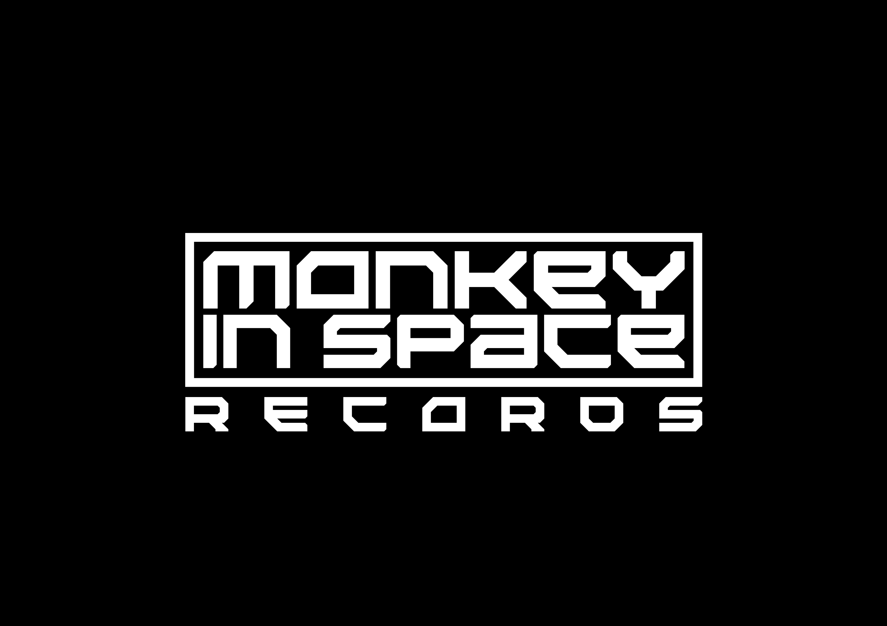

### 🌎 Idioma

🇧🇷 **Português** • 🇺🇸 [English](README.en.md)

 

# Monkey In Space Music Tech

### Divisão de Tecnologia da Monkey In Space

Construindo tecnologia para impulsionar a indústria da música.

 

---

# 👋 Bem-vindo

A **Monkey In Space Music Tech** é a divisão de tecnologia da **Monkey In Space**, criada para desenvolver soluções modernas, escaláveis e inovadoras para a indústria da música.

Nosso objetivo é construir uma infraestrutura tecnológica própria capaz de conectar artistas, gravadoras, editoras, distribuidoras e empresas do setor por meio de software, automação, metadados e inteligência de dados.

Mais do que criar ferramentas, buscamos desenvolver um ecossistema completo que contribua para a transformação digital do mercado musical.

---

# 🎯 Nossa Missão

Desenvolver tecnologia que simplifique processos, aumente a eficiência operacional e impulsione a inovação na indústria da música.

---

# 🚀 Áreas de Atuação

- 🎵 Gestão de Metadados Musicais
- 📀 Infraestrutura para Gravadoras
- 📚 Gestão de Direitos Autorais
- 🤖 Automação de Processos
- 🔗 APIs e Integrações
- 📊 Business Intelligence
- ☁️ Plataformas Web
- 🧠 Inteligência Artificial aplicada à música
- 👨‍💻 Ferramentas para Desenvolvedores

---

# 🛠️ Tecnologias

---

# 🌎 Nossa Visão

Acreditamos que a indústria da música precisa de soluções tecnológicas modernas, abertas à inovação e preparadas para os desafios do futuro.

Estamos construindo uma base sólida para desenvolver produtos que facilitem a gestão de dados, direitos, distribuição, automação e inteligência de mercado.

---

# 📂 Projetos

Nossa infraestrutura tecnológica encontra-se em desenvolvimento.

Os repositórios públicos desta organização representam pesquisas, estudos, bibliotecas e projetos que fazem parte da evolução da Monkey In Space Music Tech.

Novas soluções serão disponibilizadas gradualmente.

---

# ❤️ Open Source

Sempre que possível, disponibilizaremos bibliotecas, ferramentas e componentes em código aberto para contribuir com a comunidade de desenvolvedores e com a evolução da tecnologia aplicada ao mercado musical.

---

# 🤝 Contribuições

Sugestões, melhorias e contribuições são sempre bem-vindas.

Caso tenha interesse em colaborar com algum projeto, fique à vontade para abrir uma Issue ou um Pull Request.

---

# 📫 Contato

📧 **tech@monkeyinspace.rec.br**

🌐 Website (em breve)

---

### 🐵 Monkey In Space Music Tech

**Tecnologia • Música • Metadados • Automação • Inovação**

Desenvolvido com ❤️ no Brasil.

